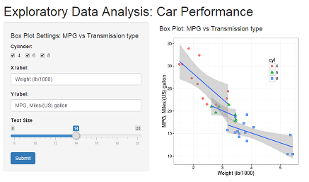

## Overview : Shiny App

- Purpose  : Data exploration and figure customization for reporting.
- Data set : data("mtcars")
- App link : https://sujitojha.shinyapps.io/Project




## Dataset 

Exploratory data analysis: To understand the relationship between "mpg" and "cyl".

```{r}
data("mtcars")
str(mtcars)
```

## MPG vs. No. of Cylinders

```{r, echo=FALSE}
library(ggplot2)
mtcars$cyl <- factor(mtcars$cyl)
```
```{r,fig.width=5, fig.height=4, fig.align='center'}
ggplot(data=mtcars, aes(wt,mpg))+
  geom_point(aes(color=cyl,shape=cyl),size=3)+
  theme_bw()+  geom_smooth(method="lm", aes(group=cyl))+
  xlab("Weight (lb/1000)")+  ylab("MPG, Miles/(US) gallon")
```

## Inputs


1. Cylinder  : Checkbox to subset data for cylinder = 4,6 or 8.
2. Xlabel    : To change the X label
3. Ylabel    : To change the Y label
4. Text size : To change the text font size.

